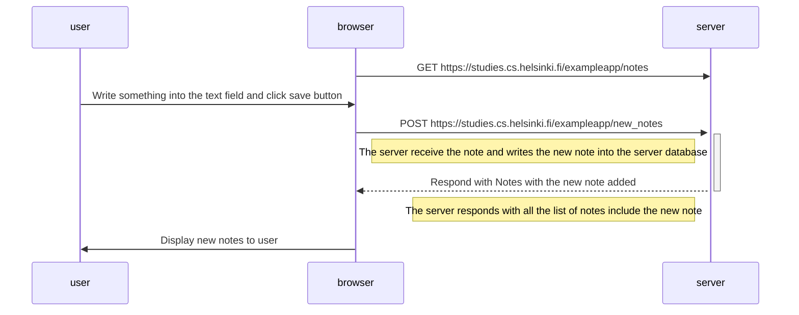

```mermaid
  sequenceDiagram
    participant user
    participant browser
    participant server

    browser->>server: GET https://studies.cs.helsinki.fi/exampleapp/notes
    activate server

    user->>browser: Write something into the text field and click save button
    activate server


    browser->>server: POST https://studies.cs.helsinki.fi/exampleapp/new_notes
    activate server
    Note left of server: The server receive the note and writes the new note into the server database

    server-->>browser: Respond with Notes with the new note added
    deactivate server

     Note left of server: The server responds with all the list of notes include the new note

     browser->>user: Display new notes to user
    

```