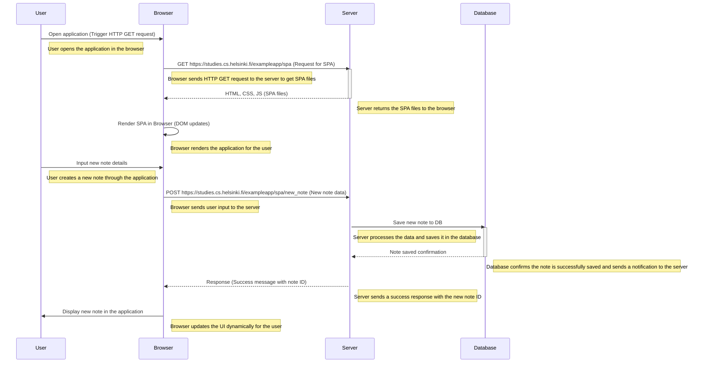

```mermaid
    sequenceDiagram
    participant User
    participant Browser
    participant Server
    participant Database


    User->>Browser: Open application (Trigger HTTP GET request)
    Note right of User: User opens the application in the browser

    Browser->>Server: GET https://studies.cs.helsinki.fi/exampleapp/spa (Request for SPA)
    activate Server
    Note right of Browser: Browser sends HTTP GET request to the server to get SPA files

    Server-->>Browser: HTML, CSS, JS (SPA files)
    deactivate Server
    Note right of Server: Server returns the SPA files to the browser


    Browser->>Browser: Render SPA in Browser (DOM updates)
    Note right of Browser: Browser renders the application for the user


    User->>Browser: Input new note details
    Note right of User: User creates a new note through the application

    Browser->>Server: POST https://studies.cs.helsinki.fi/exampleapp/spa/new_note (New note data)
    activate Server
    Note right of Browser: Browser sends user input to the server


    Server->>Database: Save new note to DB
    activate Database
    Note right of Server: Server processes the data and saves it in the database


    Database-->>Server: Note saved confirmation
    deactivate Database
    Note right of Database: Database confirms the note is successfully saved and sends a notification to the server


    Server-->>Browser: Response (Success message with note ID)
    activate Server
    Note right of Server: Server sends a success response with the new note ID


    Browser->>User: Display new note in the application
    Note right of Browser: Browser updates the UI dynamically for the user


```