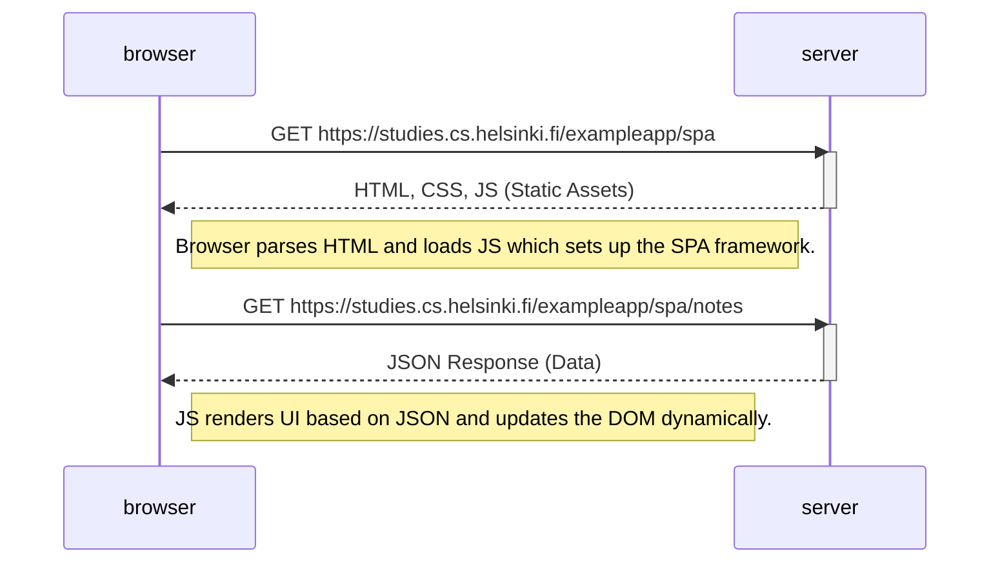

```mermaid
    sequenceDiagram
    participant browser
    participant server

    browser->>server: GET https://studies.cs.helsinki.fi/exampleapp/spa
    activate server

    server-->>browser: HTML, CSS, JS (Static Assets)
    deactivate server

    Note right of browser: Browser parses HTML and loads JS which sets up the SPA framework.

    browser->>server: GET https://studies.cs.helsinki.fi/exampleapp/spa/notes
    activate server

    server-->>browser: JSON Response (Data)
    deactivate server

    Note right of browser: JS renders UI based on JSON and updates the DOM dynamically.

```